Toriloshop is a Nigeria- based online store focused on fast and quality delivery.

## Overview
This module focuses on implementing CRUD (Create, Read, Update, Delete) operations for products and categories in a Django application. The application allows users to manage products and categories through a web interface, utilizing Django's views and URL routing to handle user requests and interactions.

## Features Implemented
1. **Add Product**
   - **URL**: `/products/add/`
   - **Description**: Form to create a new product with validation.

2. **Edit Product**
   - **URL**: `/products/<product_id>/edit/`
   - **Description**: Pre-filled form to edit an existing product.

3. **Delete Product**
   - **URL**: `/products/<product_id>/delete/` 
    - **Description**: Confirmation page to delete a product.

### Category Management
1. **Add Category**
   - **URL**: `/categories/add/`
   - **Description**: Form to create a new category with validation.
2. **Edit Category**
   - **URL**: `/categories/<category_id>/edit/`
    - **Description**: Pre-filled form to edit an existing category. 
3. **Delete Category**
   - **URL**: `/categories/<category_id>/delete/`
    - **Description**: Confirmation page to delete a category.

- **Create**: Add new products and categories.
- **Read**: View lists of products and categories.
- **Update**: Edit existing products and categories.
- **Delete**: Remove products and categories.

## Setup Instructions:
1. Create a virtual environment using: `python -m venv venv`
2. Activate the Environment using: `venv\Scripts\activate`
3. Install Django using: `pip install django`
4. Run the Server: `python manage.py runserver`
5. Access the site at http://127.0.0.1:8000/
6. Run migrations to set up the database: 
  - (i) `python manage.py makemigrations` 
  - (ii) `python manage.py migrate`
7. Create a superuser to access the admin panel: `python manage.py createsuperuser`
8. Run the development server: `python manage.py runserver`
9. Access the application at http://127.0.0.1:8000/ and the admin panel at http://127.0.0.1:8000/admin/

## Screenshots
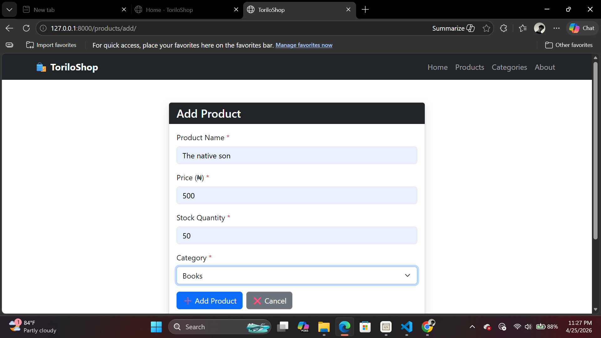

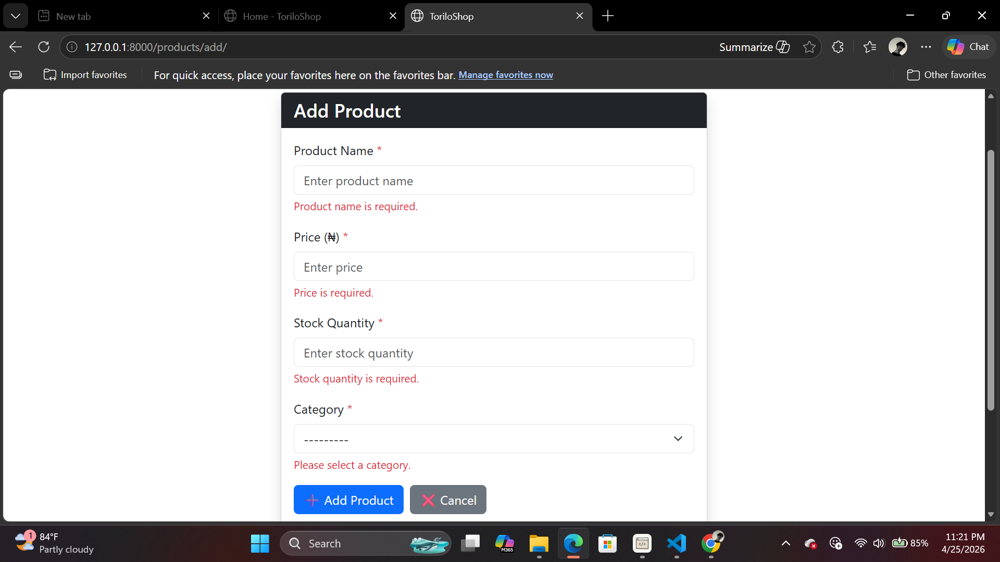

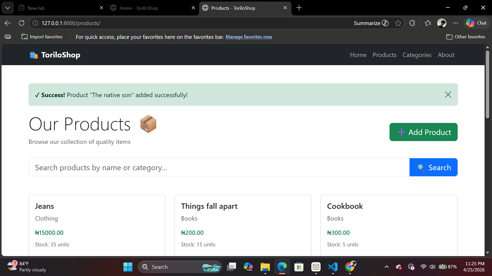

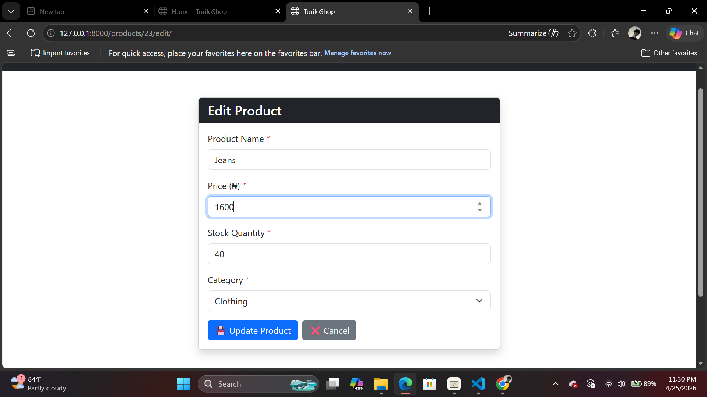

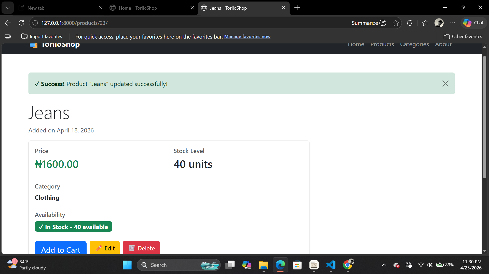

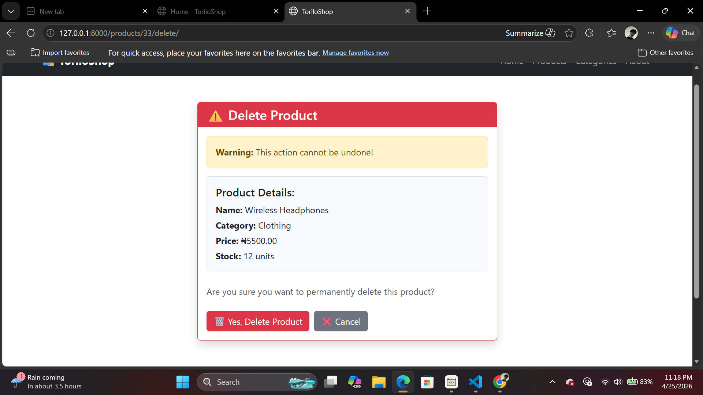

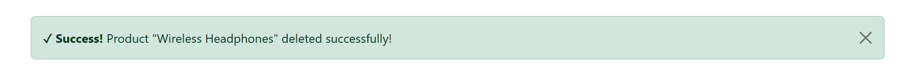

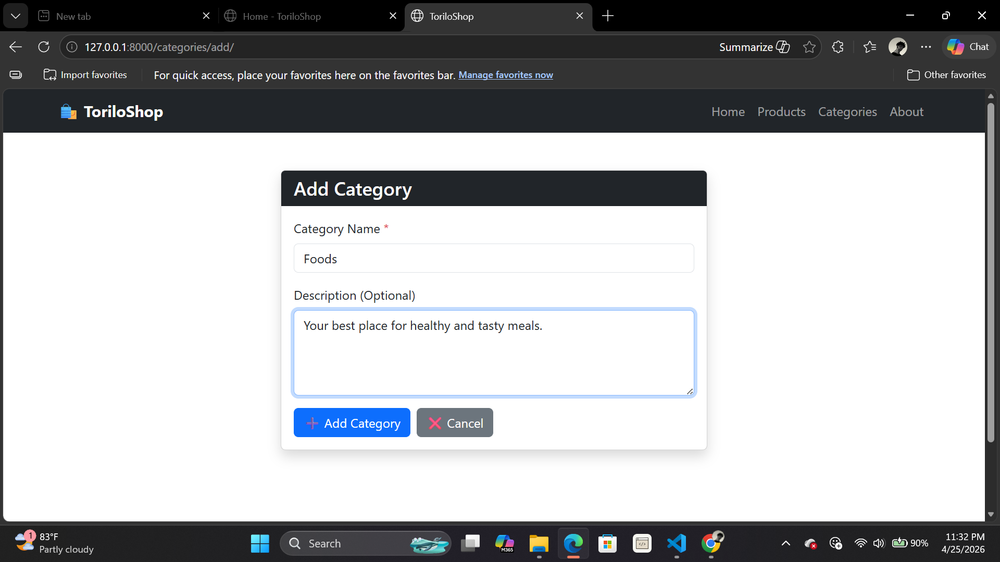

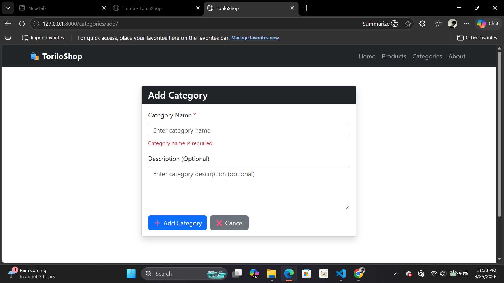

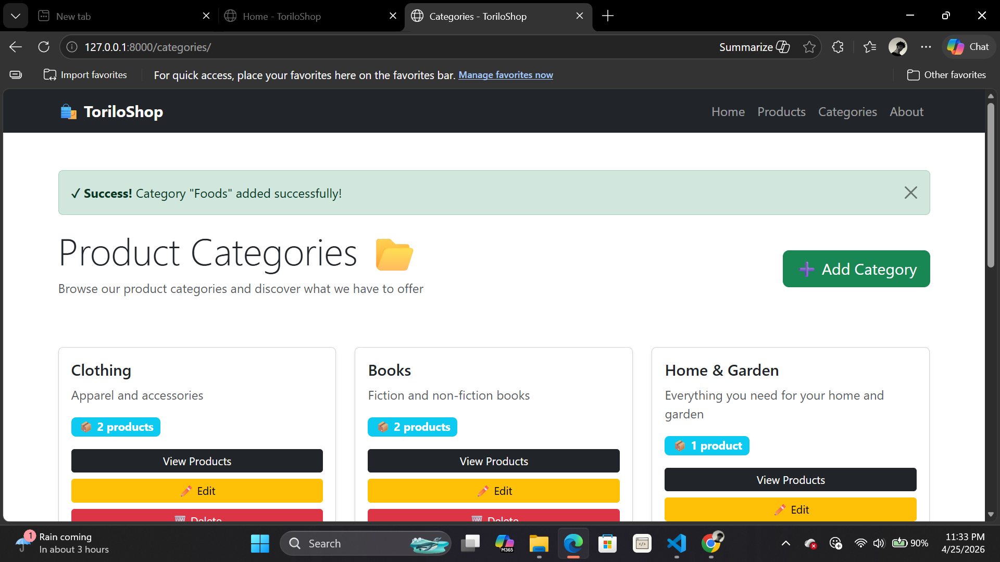

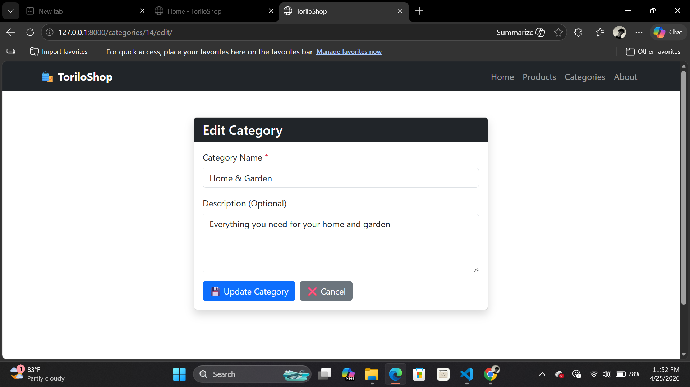

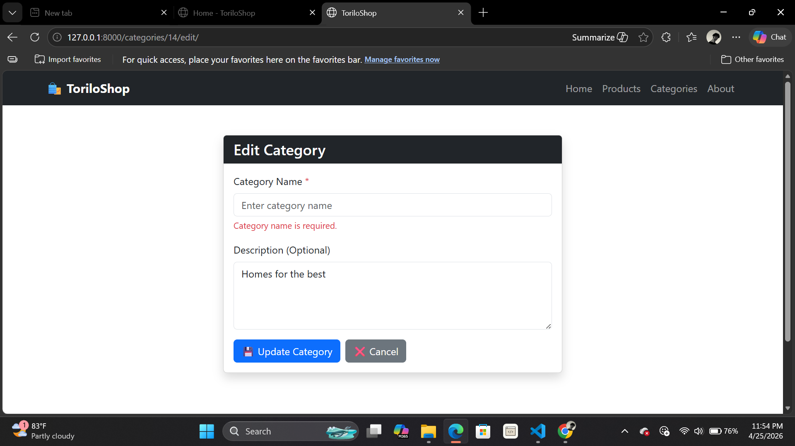

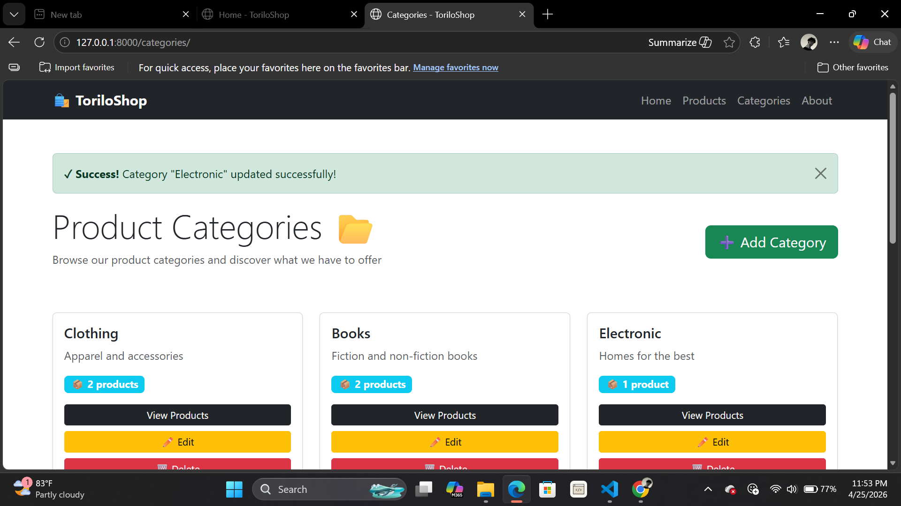

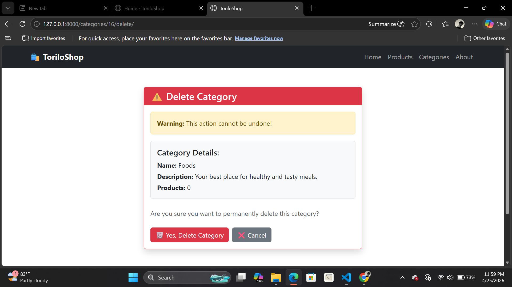

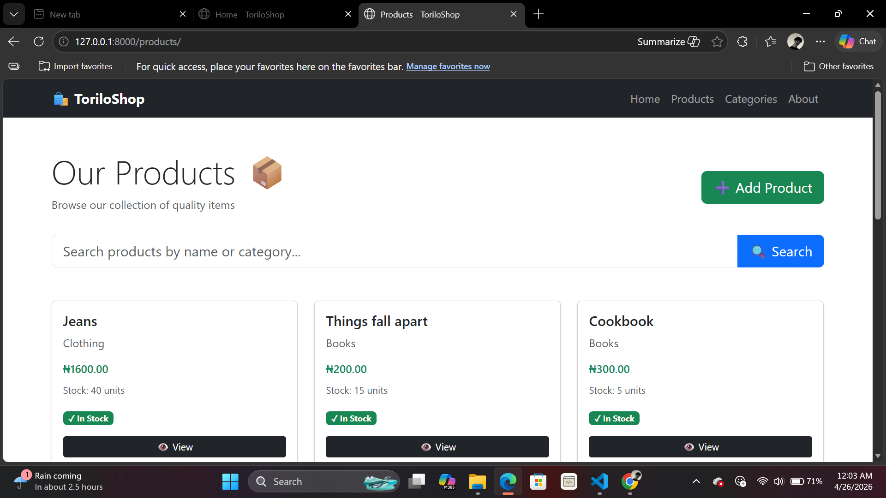

## Conclusion
This project implements basic CRUD operations for products and categories in a Django application. Users can create, read, update, and delete products and categories through a user-friendly interface. The application is structured to allow for easy expansion and integration of additional features in the future.