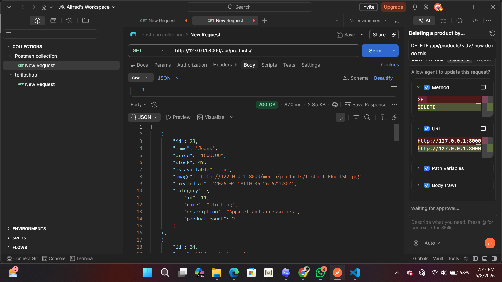
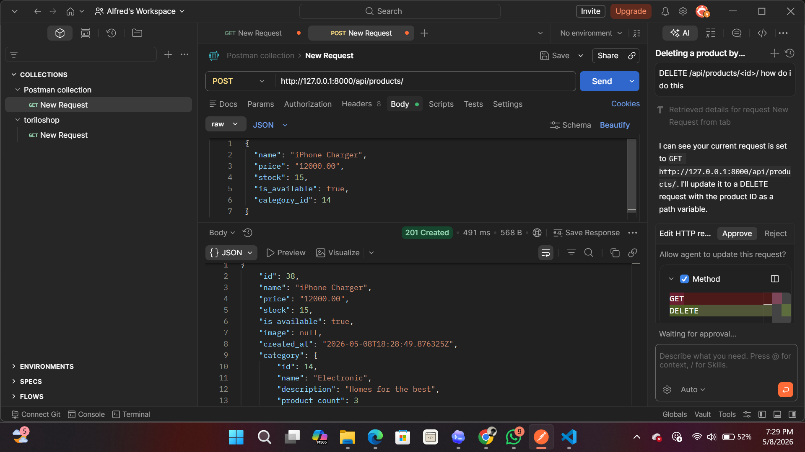
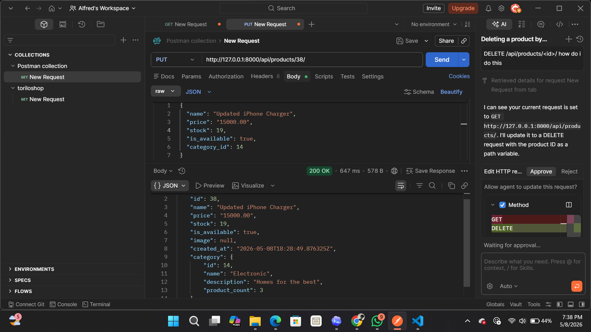
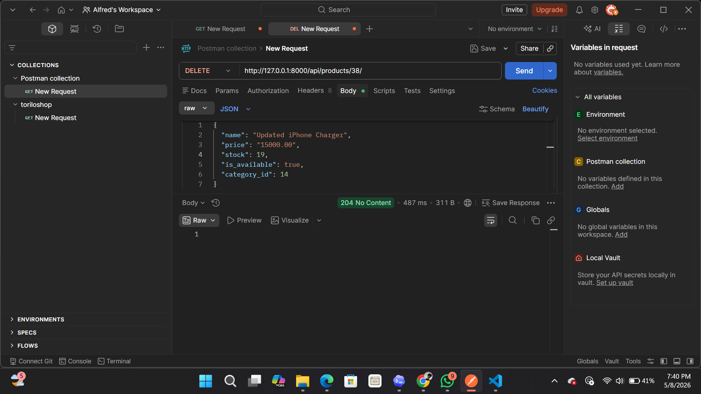
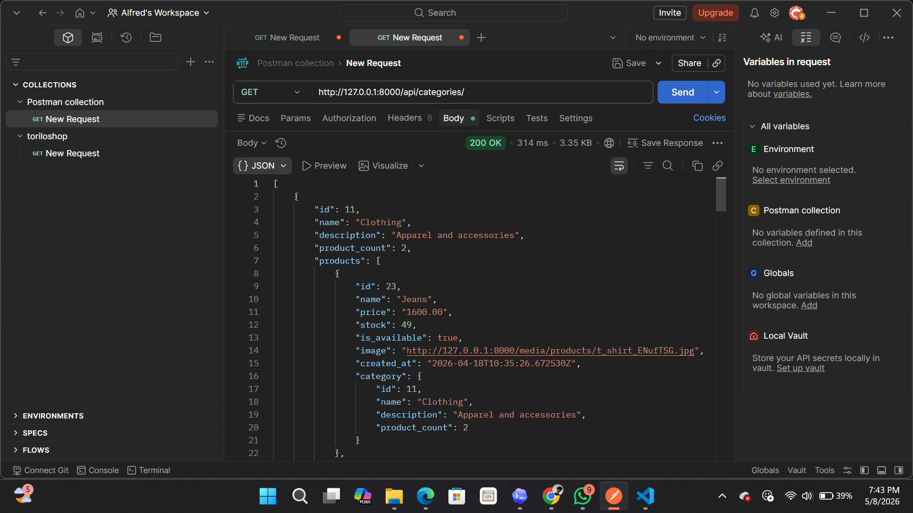

# ToriloShop REST API

ToriloShop is a Django ecommerce project with product and category management. It now exposes REST API endpoints built with Django REST Framework so products and categories can be viewed and managed using tools like Postman.

## Project Description

The ToriloShop API exposes endpoints for:

- Listing all products
- Creating a new product
- Retrieving a single product
- Fully updating a product
- Deleting a product
- Listing all categories with their products and product count

Base local URL:

```text
http://127.0.0.1:8000
```

## Features Implemented

| Method | Endpoint | What it does |
| --- | --- | --- |
| GET | `/api/products/` | Lists all products with nested category details |
| POST | `/api/products/` | Creates a new product |
| GET | `/api/products/<id>/` | Retrieves one product by ID |
| PUT | `/api/products/<id>/` | Fully updates one product by ID |
| DELETE | `/api/products/<id>/` | Deletes one product by ID |
| GET | `/api/categories/` | Lists all categories with product count and products |

## Setup Instructions

From the `module-13` folder, create and activate a virtual environment:

```bash
python -m venv venv
venv\Scripts\activate
```

Install the required packages:

```bash
pip install djangorestframework
```

Run migrations:

```bash
python manage.py migrate
```

Start the development server:

```bash
python manage.py runserver
```

Open the API in your browser or Postman:

```text
http://127.0.0.1:8000/api/products/
http://127.0.0.1:8000/api/categories/
```

## Testing With Postman

### List Products

```text
GET http://127.0.0.1:8000/api/products/
```

### Create Product

```text
POST http://127.0.0.1:8000/api/products/
```

Body -> raw -> JSON:

```json
{
  "name": "iPhone Charger",
  "price": "15000.00",
  "stock": 20,
  "is_available": true,
  "category_id": 14
}
```

Use a `category_id` that already exists in the database. You can check valid category IDs with:

```text
GET http://127.0.0.1:8000/api/categories/
```

### Retrieve One Product

```text
GET http://127.0.0.1:8000/api/products/1/
```

Replace `1` with the product ID.

### Update Product

```text
PUT http://127.0.0.1:8000/api/products/1/
```

Body -> raw -> JSON:

```json
{
  "name": "Updated iPhone Charger",
  "price": "18000.00",
  "stock": 15,
  "is_available": true,
  "category_id": 14
}
```

PUT is a full update, so include all required product fields.

### Delete Product

```text
DELETE http://127.0.0.1:8000/api/products/1/
```

Replace `1` with the product ID. A successful delete returns:

```text
204 No Content
```

### List Categories

```text
GET http://127.0.0.1:8000/api/categories/
```
This returns all categories with their products and product count.


### SCREENSHOTS:












## Conclusion
The ToriloShop REST API allows you to manage products and categories programmatically. You can create, read, update, and delete products, as well as view category details.
