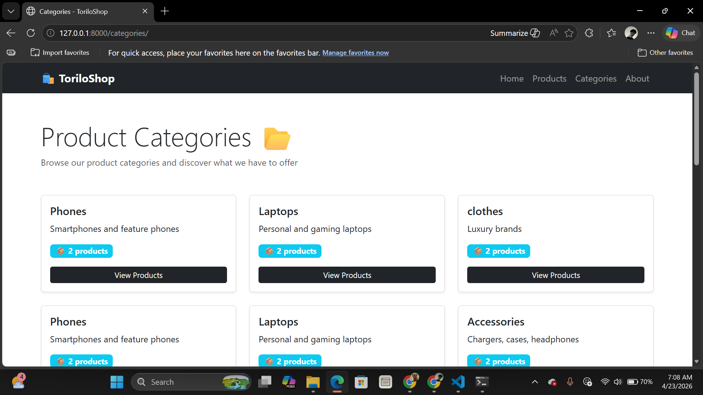
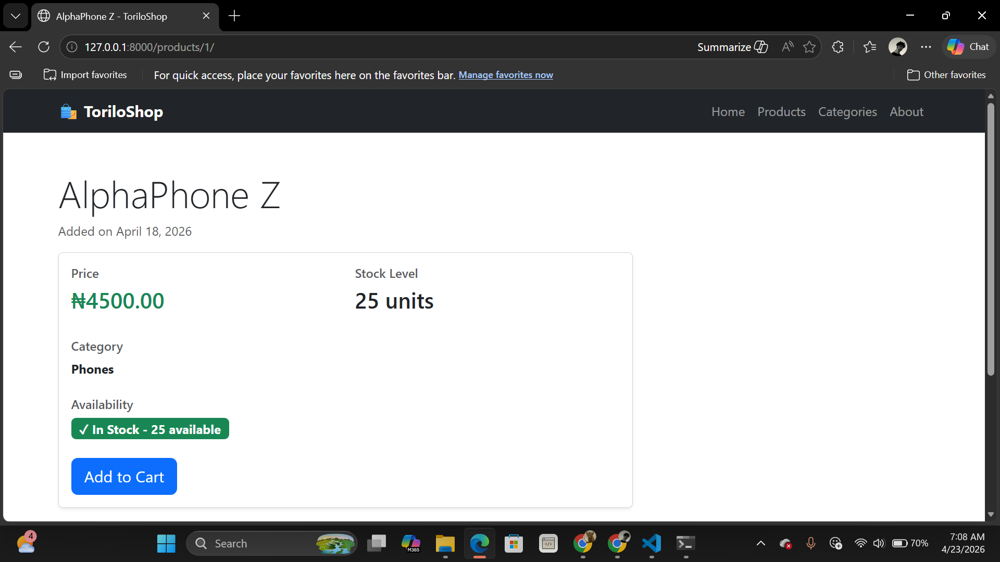
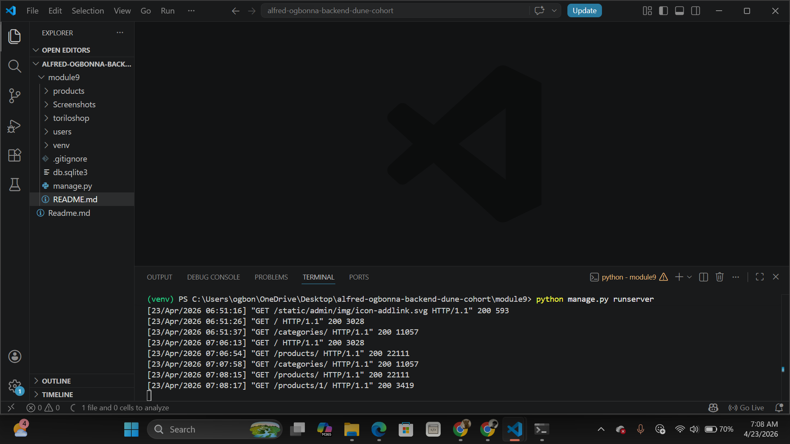
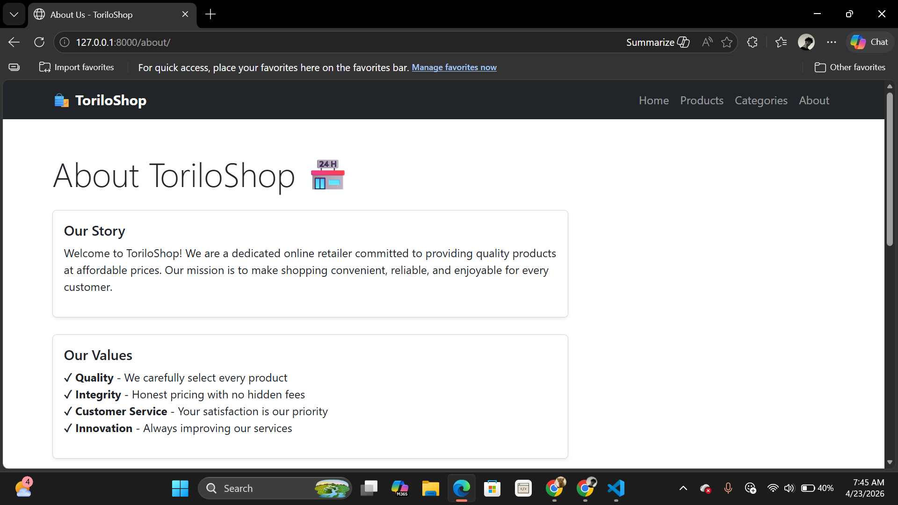

Toriloshop is a Nigeria- based online store focused on fast and quality delivery.

## Features Implemented: List each view and URL.
- **Home View (`/`)**: Landing page for toriloshop.
- **Product List View (`/products/`)**: Displays a catalog of available items.
- **About View (`/about/`)**: Information regarding the store's history and mission.
- **Category View (`/categories/`)**: Showcases different product categories.
- Custom 404 Error Page

## Setup Instructions:
1. Create a virtual environment using: `python -m venv venv`
2. Activate the Environment using: `venv\Scripts\activate`
3. Install Django using: `pip install django`
4. Run the Server: `python manage.py runserver`
5. Access the site at http://127.0.0.1:8000/
6. Run migrations to set up the database: 
  - (i) `python manage.py makemigrations` 
  - (ii) `python manage.py migrate`
7. Create a superuser to access the admin panel: `python manage.py createsuperuser`
8. Run the development server: `python manage.py runserver`
9. Access the application at http://127.0.0.1:8000/ and the admin panel at http://127.0.0.1:8000/admin/

## Screenshots:

